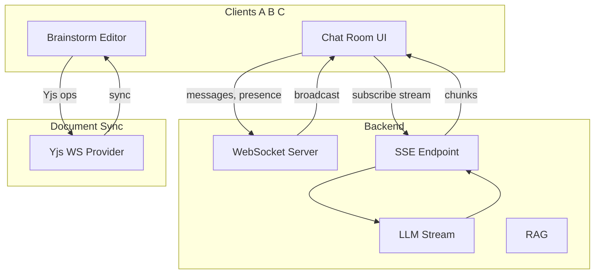

# Pet Project: AI RAG Editor

## Концепция

Редактор на Plate.js с AI-ассистентом и коллаборацией:

1. **Параллельный чат** — несколько пользователей в одной комнате видят общий чат в реальном времени (SSE/WebSocket): сообщения, стрим LLM, RAG-результаты.
2. **Коллаборативный документ brainstorm** — участники совместно (real-time или асинхронно) составляют саммари/документ на основе расследования в чате через Plate.js.

Панель RAG-результатов — виртуализированный Infinite Scroll с оптимизацией reflow.

## Архитектура




- **SSE** — односторонний стрим LLM всем подписчикам комнаты.
- **WebSocket** — сообщения чата, presence, typing.

## Feature-Sliced Design (FSD)

### Требования по архитектурному стилю

Проект следует методологии [Feature-Sliced Design](https://feature-sliced.design/): иерархия слоёв, слайсов и сегментов. Импорты только вниз по слоям (shared ← entities ← features ← widgets ← pages ← app).

### Слои и слайсы

```mermaid
flowchart TD
    subgraph app [App]
        providers[providers]
        routing[routing]
    end

    subgraph pages [Pages]
        editorPage[editor-page]
        roomPage[room-page]
    end

    subgraph widgets [Widgets]
        editorWidget[editor-widget]
        chatRoom[chat-room]
        brainstormEditor[brainstorm-editor]
        ragPanel[rag-panel]
        llmStream[llm-stream]
    end

    subgraph features [Features]
        submitQuery[submit-query]
        streamDisplay[stream-display]
        joinRoom[join-room]
        sendMessage[send-message]
        syncDocument[sync-document]
        insertFromChat[insert-from-chat]
    end

    subgraph entities [Entities]
        room[room]
        message[message]
        participant[participant]
        document[document]
        documentBlock[document-block]
        searchResult[search-result]
        citation[citation]
        llmChunk[llm-chunk]
    end

    subgraph shared [Shared]
        ui[ui]
        api[api]
        lib[lib]
    end

    app --> pages
    pages --> widgets
    widgets --> features
    features --> entities
    entities --> shared
```




| Слой         | Слайсы                                                                                   | Назначение                                   |
| ------------ | ---------------------------------------------------------------------------------------- | -------------------------------------------- |
| **app**      | —                                                                                        | providers, routing, entrypoint               |
| **pages**    | editor-page, room-page                                                                   | Страницы: редактор, комната (чат + документ) |
| **widgets**  | editor-widget, chat-room, brainstorm-editor, rag-panel, llm-stream                       | Чат, коллаборативный редактор, RAG, стрим    |
| **features** | submit-query, stream-display, join-room, send-message, sync-document, insert-from-chat   | Бизнес-фичи                                  |
| **entities** | room, message, participant, document, document-block, search-result, citation, llm-chunk | Бизнес-сущности                              |
| **shared**   | ui, api, lib                                                                             | VirtualResultsList, API-клиент, normalizer   |


### Сегменты внутри слайсов

- `ui` — React-компоненты
- `model` — store (Zustand), типы, селекторы
- `api` — запросы к бэкенду
- `lib` — внутренние хелперы слайса
- `config` — конфигурация (при необходимости)

### Правила импортов

- Слайс импортирует только из нижележащих слоёв
- Внешний код обращается к слайсу только через публичный API (`index.ts`)
- В shared сегменты могут импортировать друг друга

### Публичные API слайсов

- `entities/room` — `roomStore`, `useRoom`, `selectMessagesByRoom`
- `entities/message` — `messageStore`, `MessageItem`
- `entities/participant` — `participantStore`, `useParticipants`
- `entities/document` — `documentStore`, `useDocument` (roomId, documentId, syncStrategy)
- `entities/document-block` — блоки документа (Yjs или custom)
- `entities/search-result` — `searchResultStore`, `selectResultsForQuery`
- `features/join-room` — `useJoinRoom`, подписка на SSE/WebSocket
- `features/send-message` — `SendMessageButton`, `useSendMessage`
- `features/sync-document` — `useSyncDocument` (Yjs Provider)
- `features/insert-from-chat` — вставка фрагмента из сообщения в документ
- `widgets/chat-room` — чат + участники + стрим LLM
- `widgets/brainstorm-editor` — Plate.js + коллаборация, панель «вставить из чата»
- `shared/ui` — `VirtualResultsList`, `Button`

## Стек


| Категория     | Технология                              |
| ------------- | --------------------------------------- |
| RTE           | Plate.js (React)                        |
| State         | Zustand (нормализованные entities)      |
| Build         | Vite                                    |
| Real-time     | WebSocket, SSE                          |
| Document sync | Yjs + y-websocket                       |
| RAG Backend   | ELSER (Elastic) или Yandex Search Index |
| LLM           | OpenAI API / Yandex GPT (streaming)     |


## Нормализованный state (Zustand)

```typescript
// byId + allIds паттерн
{
  rooms: { byId: {}, allIds: [] },
  messages: { byId: {}, allIds: [] },
  participants: { byId: {}, allIds: [] },
  documents: { byId: {}, allIds: [] },
  documentBlocks: { byId: {}, allIds: [] },
  searchResults: { byId: {}, allIds: [] },
  citations: { byId: {}, allIds: [] },
  llmChunks: { byId: {}, allIds: [] }
}
```

Ссылки: `room.documentId` → document, `message.roomId` → room, `message.authorId` → participant, `searchResult.sourceId` → citation.

## Reflow-оптимизированный компонент

**Infinite Scroll** для панели RAG-результатов — из [tech/components/reflow-demos/InfiniteScroll.jsx](tech/components/reflow-demos/InfiniteScroll.jsx):

- Виртуализация: рендер только видимых элементов
- RAF + batch read → batch write
- `transform` вместо `top` для offset
- Пассивный scroll listener

При 100+ результатах RAG без виртуализации — layout thrashing при скролле. С оптимизацией — плавный скролл.

## Фичи: коллаборативный чат и документ

### 1. Параллельный чат (SSE / WebSocket)

Несколько пользователей в одной комнате видят общий чат в реальном времени.

- **SSE** — стрим LLM всем подписчикам комнаты.
- **WebSocket** — сообщения, presence, typing.
- Сущности: `room`, `message`, `participant`.
- `messagesByRoom: { [roomId]: messageIds[] }` — порядок сообщений.

### 2. Коллаборативный документ brainstorm

Документ связан с комнатой чата. Участники совместно составляют саммари по результатам расследования в чате.

- **Связь**: `room.documentId` → document.
- **Синхронизация**:
  - **Real-time**: Yjs + WebSocket Provider (`@udecode/plate-yjs`).
  - **Async**: debounce + push на сервер, merge на бэкенде.
- **insert-from-chat** — вставка фрагмента из сообщения в документ.

## Структура проекта (FSD)

```
pet-rag-editor/
├── src/
│   ├── app/
│   │   ├── providers.tsx
│   │   ├── router.tsx
│   │   └── index.tsx
│   │
│   ├── pages/
│   │   ├── editor-page/
│   │   │   ├── ui/EditorPage.tsx
│   │   │   └── index.ts
│   │   └── room-page/
│   │       ├── ui/RoomPage.tsx
│   │       └── index.ts
│   │
│   ├── widgets/
│   │   ├── editor-widget/
│   │   ├── chat-room/
│   │   ├── brainstorm-editor/
│   │   ├── rag-panel/
│   │   └── llm-stream/
│   │
│   ├── features/
│   │   ├── submit-query/
│   │   ├── stream-display/
│   │   ├── join-room/
│   │   ├── send-message/
│   │   ├── sync-document/
│   │   └── insert-from-chat/
│   │
│   ├── entities/
│   │   ├── room/
│   │   ├── message/
│   │   ├── participant/
│   │   ├── document/
│   │   ├── document-block/
│   │   ├── search-result/
│   │   ├── citation/
│   │   └── llm-chunk/
│   │
│   └── shared/
│       ├── ui/VirtualResultsList/
│       ├── api/
│       └── lib/normalizer.ts
├── package.json
└── vite.config.ts
```

## Ключевые потоки данных

### 1. RAG-запрос → нормализация → store

```
API response (nested) → normalizer → entitiesStore.searchResults.addMany
```

### 2. LLM streaming с backpressure

```
ReadableStream → reader.read() → batch chunks → entitiesStore.llmChunks.addOne
await setTimeout(0) между батчами — yield main thread
```

### 3. RAG Panel → VirtualResultsList

```
selectSearchResultsForQuery(store, queryId) → ids
VirtualResultsList (shared/ui): RAF + transform, рендер slice(visibleStart, visibleEnd)
```

Импорты по FSD: `widgets/rag-panel` → `entities/search-result` (селектор) + `shared/ui` (VirtualResultsList).

### 4. Чат: WebSocket → store

```
WS message (new_message) → messageStore.addOne
WS message (user_joined) → participantStore.addOne
```

### 5. Документ: Yjs sync

```
Plate.js changes → Yjs doc → y-websocket → server
Server → Yjs doc → Plate.js (все клиенты в комнате)
```

## Этапы реализации (с учётом FSD)

1. **Скелет**: Vite + React, Plate.js, Zustand, структура папок FSD
2. **shared**: `lib/normalizer`, `api/baseFetch`, `ui/VirtualResultsList` (порт из [InfiniteScroll.jsx](tech/components/reflow-demos/InfiniteScroll.jsx))
3. **entities**: document, search-result, citation, llm-chunk
4. **features**: submit-query, stream-display
5. **widgets**: editor-widget, rag-panel, llm-stream
6. **pages + app**: editor-page, providers, routing
7. **entities**: room, message, participant
8. **Backend**: WebSocket-сервер (rooms, messages, presence), SSE для LLM-стрима
9. **features**: join-room, send-message
10. **widgets**: chat-room
11. **entities**: document-block, связь document ↔ room
12. **Document sync**: Yjs + WebSocket Provider (`@udecode/plate-yjs`)
13. **features**: sync-document, insert-from-chat
14. **widgets**: brainstorm-editor
15. **pages**: room-page (чат + документ)

## Зависимости (package.json)

```json
{
  "dependencies": {
    "@udecode/plate": "^x.x",
    "@udecode/plate-yjs": "^x.x",
    "yjs": "^13.x",
    "y-websocket": "^1.x",
    "zustand": "^4.x",
    "react": "^18.x",
    "react-dom": "^18.x"
  }
}
```

## Альтернатива: Redux Toolkit

Вместо Zustand — `createEntityAdapter` в RTK. Паттерн тот же: byId/allIds, селекторы для denormalization. RTK Query можно использовать для RAG/LLM API.